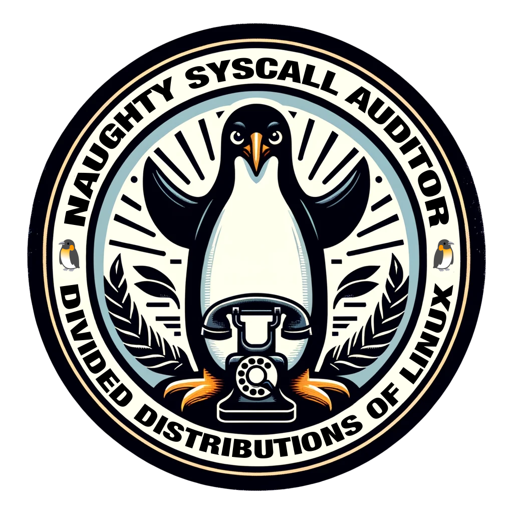

# Nosey Syscall Auditor

NSA, a tortured backronym for Nosey Syscall Auditor, is a simple tool to audit system calls made by a process. 

I'm sorry. I couldn't resist.

## Usage

```bash
LD_PRELOAD=./nsa.so make all
```
